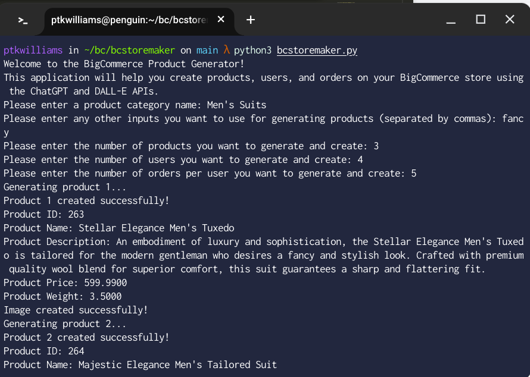
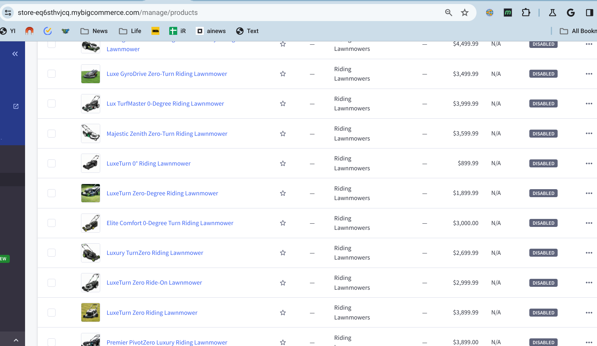
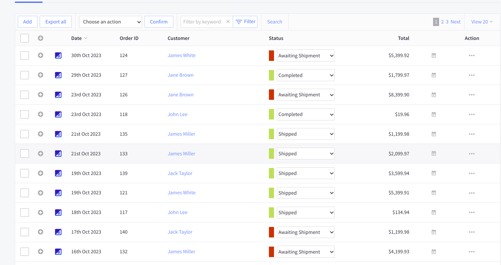

# Bigcommerce Store Maker with Dall-E and ChatGPT

This CLI tool can be used to create fake product data on a Bigcommerce store. It will create a number of products in a new/existing category with prices, images, weights, and descriptions.

It will also create a specified number of users with a specified number of orders using the newly created products. 

All products will be listed and visible on channel 1 (stencil) by default. 

This was built 95% with Bing.com/chat and copy/paste.

## How to use

1. Clone the repo. 
2. Install dependencies `pip install openai bigcommerce`
3. Enter your [BigCommerce](https://support.bigcommerce.com/s/article/Store-API-Accounts?language=en_US) and [OpenAI](https://help.openai.com/en/articles/4936850-where-do-i-find-my-secret-api-key) API credentials in the config object.
4. Run the script `python bcstoremaker.py`. You will be prompted for a category of products to create. **This category will be created in your store if it does not exist**
5. Enter any extra keywords you want GPT to consider when creating your products
6. Enter how many products you want created
7. Enter how many users and orders you want created
8. Wait for the script to run.

## Cost
Doing some rough napkin math, generating 1000 products with 512x512 images should cost you about $27 ($9 for GPT-4 and $18 for 1000 dalle images). The $9 could be reduced some by switching to gpt-3 or another cheaper model. 

## Screenshots

## Todos
* Status IDs selection
* Make more efficient by asking for batches of products from GPT
* Support category nesting
* Support multiple categories at once
* Ask GPT to edit store settings? 