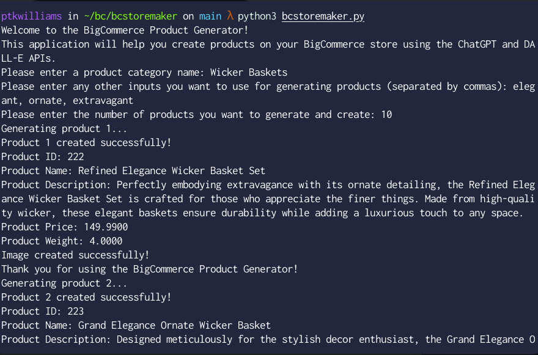

# Bigcommerce Store Maker with Dall-E and ChatGPT

This CLI tool can be used to create fake product data on a Bigcommerce store. It will create a number of products in a new/existing category with prices, images, weights, and descriptions.

This was built 95% with Bing.com/chat and copy/paste.

## How to use

1. Clone the repo. 
2. Install dependencies `pip install openai bigcommerce`
3. Enter your BigCommerce and OpenAI API credentials in the config object.
4. Run the script `python bcstoremaker.py`. You will be prompted for a category of products to create. **This category will be created in your store if it does not exist**
5. Enter any extra keywords you want GPT to consider when creating your products
6. Enter how many products you want created
7. Wait for the script to run.

## Screenshots

